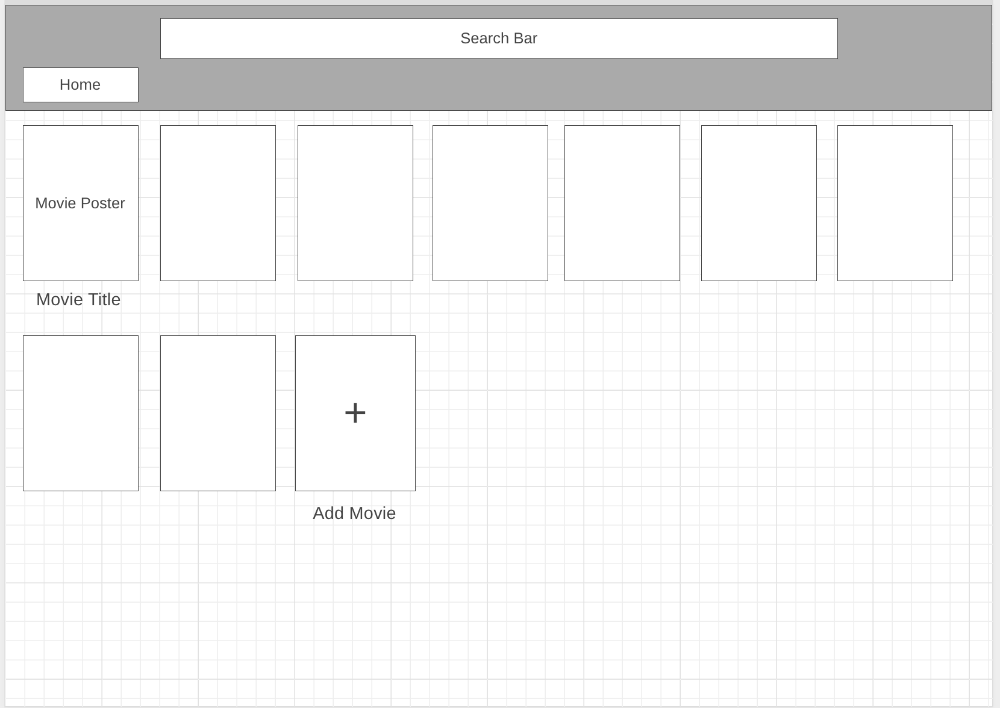
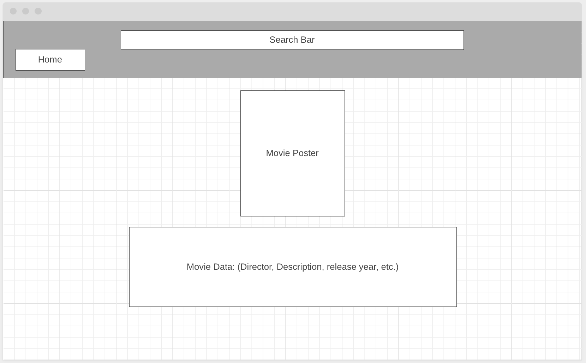

# MovieScope

## Pitch

MovieScope is an interactive app where users can access information about a collection of movies and view crowd-sourced ratings and reviews. Users can participate by sharing their own opinions, and adding/deleting movies from the collection. 

## Wireframe

Home Page

Movie Detail Page

## User Stories

- As a user, I want to be able to view a list of all movie cards upon loading the home page (GET). 
- I want to be able to filter the movies displayed on the home page by searching movies by title. 
- Clicking on a movie card will bring up the detail page for the clicked movie (GET). 
- Clicking ‘Edit/Update’ will open a form to edit that movie’s data (GET). Submitting that form will update the data and re-render the page with the update (PUT). 
- I want to click a link to navigate to a form where I can add a new movie to the database (POST). 
- I also want to be able to delete a movie from the database (DELETE).

## Authors and Acknowledgement

Created by John Phonxaya and Wes Peters

## License

[MIT](https://choosealicense.com/licenses/mit/)

## How to Run this App in Your Local Environment

Fork and clone to your machine.

In the project directory, you can run:
### `npm install`
Then run:
### `npm start`

Runs the app in the development mode.\
Open [http://localhost:3000](http://localhost:3000) to view it in your browser.

The page will reload when you make changes.\
You may also see any lint errors in the console.

### `npm run server`

Starts the j-son server.

## General Functionality of this Single-Page Application

Here is the general functionality of this single-page application:

- The application is a movie database.
- The application consists of four main views:
  - The home page shows a list of movies fetched from an API. Each movie is displayed on a card with details and a link to a detailed view.
  - Clicking on a movie card navigates the user to a movie detail page, displaying more information about the movie and an option to edit the movie details.
  - The "Add Movie" page provides a form for the user to add a new movie to the database.
  - The "Edit Movie" page provides a form to edit the title of the existing movie.
- The application uses React Router to manage the routing between these views.

Here is a breakdown of the code for each component:

**App.js**
- Imports the necessary libraries and components.
- Defines the `App` function, which returns the component to be rendered.
- Inside the `App` function, `Router`, `NavBar` and `Routes` are used to set up the application's routes and render the navbar.
- Five `Route` components are defined, each with a `path` prop indicating the URL path for the route and an `element` prop providing the component to render when the route is active.

**NavBar.js**
- Imports the necessary libraries.
- Defines the `NavBar` function, which returns a `nav` element with two `Link` components, one for the homepage and one for the Add Movie page. These links are styled with CSS classes.

**MovieList.js**
- Imports the necessary libraries and components.
- Defines the `MovieList` function. Inside, a `useState` hook is used to create a state variable for the list of movies, and a `useEffect` hook is used to fetch the movie data from the API when the component mounts.
- The component renders a `div` that maps over the list of movies and creates a `MovieCard` for each one.

**MovieDetail.js**
- Imports the necessary libraries.
- Defines the `MovieDetail` function. Inside, a `useState` hook is used to create a state variable for the current movie, and a `useEffect` hook is used to fetch the data for the movie from the API when the component mounts or when the `id` prop changes.
- The component renders a `div` with detailed information about the movie and a `Link` to the Edit Movie page.

**MovieCard.js**
- Imports the necessary libraries.
- Defines the `MovieCard` function, which receives a movie object as a prop and returns a `Link` component that wraps a `div` with the movie's details. The `to` prop on the `Link` sets the URL to the movie's detail page.

**EditMovieForm.js**
- Imports the necessary libraries.
- Defines the `EditMovieForm` function, which receives a `match` prop from the router. Inside, a `useState` hook is used to create a state variable for the movie title, and a `useEffect` hook is used to fetch the current title from the API when the component mounts or when the `id` changes.
- The component renders a form that allows the user to edit the movie title and submits a `PUT` request to the API with the new title when the form is submitted.

**AddMovieForm.js**
- Imports the necessary libraries.
- Defines the `AddMovieForm` function. Inside, `useState` hooks are used to create state variables for the title, director, description, rating, and image URL of the new movie.
- The component renders a form that allows the user to enter these values and submits a `POST` request to the API with the new movie data when

## React App Info

### `npm test`

Launches the test runner in the interactive watch mode.\
See the section about [running tests](https://facebook.github.io/create-react-app/docs/running-tests) for more information.

### `npm run build`

Builds the app for production to the `build` folder.\
It correctly bundles React in production mode and optimizes the build for the best performance.

The build is minified and the filenames include the hashes.\
Your app is ready to be deployed!

See the section about [deployment](https://facebook.github.io/create-react-app/docs/deployment) for more information.

### `npm run eject`

**Note: this is a one-way operation. Once you `eject`, you can't go back!**

If you aren't satisfied with the build tool and configuration choices, you can `eject` at any time. This command will remove the single build dependency from your project.

Instead, it will copy all the configuration files and the transitive dependencies (webpack, Babel, ESLint, etc) right into your project so you have full control over them. All of the commands except `eject` will still work, but they will point to the copied scripts so you can tweak them. At this point you're on your own.

You don't have to ever use `eject`. The curated feature set is suitable for small and middle deployments, and you shouldn't feel obligated to use this feature. However we understand that this tool wouldn't be useful if you couldn't customize it when you are ready for it.

## Learn More

You can learn more in the [Create React App documentation](https://facebook.github.io/create-react-app/docs/getting-started).

To learn React, check out the [React documentation](https://reactjs.org/).

### Code Splitting

This section has moved here: [https://facebook.github.io/create-react-app/docs/code-splitting](https://facebook.github.io/create-react-app/docs/code-splitting)

### Analyzing the Bundle Size

This section has moved here: [https://facebook.github.io/create-react-app/docs/analyzing-the-bundle-size](https://facebook.github.io/create-react-app/docs/analyzing-the-bundle-size)

### Making a Progressive Web App

This section has moved here: [https://facebook.github.io/create-react-app/docs/making-a-progressive-web-app](https://facebook.github.io/create-react-app/docs/making-a-progressive-web-app)

### Advanced Configuration

This section has moved here: [https://facebook.github.io/create-react-app/docs/advanced-configuration](https://facebook.github.io/create-react-app/docs/advanced-configuration)

### Deployment

This section has moved here: [https://facebook.github.io/create-react-app/docs/deployment](https://facebook.github.io/create-react-app/docs/deployment)

### `npm run build` fails to minify

This section has moved here: [https://facebook.github.io/create-react-app/docs/troubleshooting#npm-run-build-fails-to-minify](https://facebook.github.io/create-react-app/docs/troubleshooting#npm-run-build-fails-to-minify)
